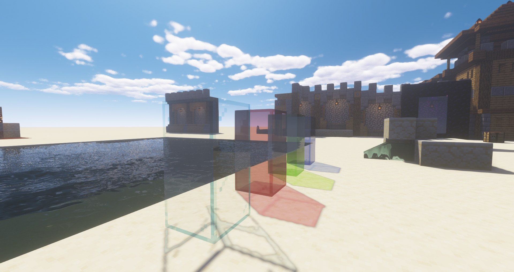

# BSL++ shaders 
##### Based off of [BSL v7.1.02.2 by Capt Tatsu](https://bitslablab.com)

### Overview
Custom BSL shaders that enjoy the performance boost of BSL while still having more physically accurate water shaders present in other major shaders like Kuda. Since this is mostly a personal project, I removed features that I do not use: RP Support, Cel Shading, Lightmap Banding. 

### Key Changes
- Water:
    - refraction
    - multiplicative color
    - volumetric fog
    - tweaked water surface function
- General Transparency:
    - multiplicative color
    - reflective glass and ice
- Lighting:
    - support for greater dynamic range
    - tweaked sky gradients
    - tweaked light parameters
    - tweaked rain blending

### WIP
- Caustics
- Perfecting water fog

#### Dynamic Range
The original shaders had a clamped dynamic range that made the image look drab. It also contributes to low contrast between low light areas and outdoor areas. I adjusted the colors and lighting parameters and added support for hdr light sources (simulated hdr, not actual display hdr). This makes the image a touch more photoreal.

    <table style="width:100%">
        <tr>
            <td align="middle">
              
              <figcaption align="middle">BSL</figcaption>
            </td>
            <td align="middle">
               
              <figcaption align="middle">BSL++</figcaption>
            </td>
        </tr>
        <tr>
            <td align="middle">
              
              <figcaption align="middle">BSL</figcaption>
            </td>
            <td align="middle">
               
              <figcaption align="middle">BSL++</figcaption>
            </td>
        </tr>
    </table>

#### Refraction
An approximate refraction model that displaces texture sample by a scaled surface normal. This gives water, glass, and ice more of a physical presence.

    <table style="width:100%">
        <tr>
            <td align="middle">
              
              <figcaption align="middle">BSL</figcaption>
            </td>
            <td align="middle">
               
              <figcaption align="middle">BSL++</figcaption>
            </td>
        </tr>
    </table>

#### Reflections
BSL already has great reflections. Unlike other shaders, BSL calculates multibounce reflections by using previous frame buffers. With such great reflections, they should be showcased whenever possible. I adjusted the material properties of ice and glass so that they are reflective.

    <table style="width:100%">
        <tr>
            <td align="middle">
              
              <figcaption align="middle">BSL</figcaption>
            </td>
            <td align="middle">
              
              <figcaption align="middle">BSL++</figcaption>
            </td>
        </tr>
    </table>

#### Multiplicative Color
I take a more physically based model of transparency. Colored glass filters out certain colors to produce an output color. This can be simulated by multiplying the glass color with the color of the scene behind it. This is also true (but less so) for reflections.

    <table style="width:100%">
        <tr>
            <td align="middle">
              
              <figcaption align="middle">BSL</figcaption>
            </td>
            <td align="middle">
              
              <figcaption align="middle">BSL++</figcaption>
            </td>
        </tr>
    </table>

#### Rain Blending
Reduced the transparency of rain and enabled proper blending with water and glass transparencies. Increased contrast of outdoor blocks to simulate a "wet" texture (prevents a washed out image from the gray lighting).

    <table style="width:100%">
        <tr>
            <td align="middle">
              
              <figcaption align="middle">BSL</figcaption>
            </td>
            <td align="middle">
              
              <figcaption align="middle">BSL++</figcaption>
            </td>
        </tr>
    </table>

#### Sky Gradients
This is more a matter of personal taste. The sky gradients in the original shader are too steep, making the sky look fantastical / cartoony (half orange half blue sky). I reduced the gradient by adding a bias to the <skypos,lightpos> dot product. These shots were taken at the same in-game time.

    <table style="width:100%">
        <tr>
            <td align="middle">
              
              <figcaption align="middle">BSL</figcaption>
            </td>
            <td align="middle">
              
              <figcaption align="middle">BSL++</figcaption>
            </td>
        </tr>
        <tr>
            <td align="middle">
              
              <figcaption align="middle">BSL</figcaption>
            </td>
            <td align="middle">
              
              <figcaption align="middle">BSL++</figcaption>
            </td>
        </tr>
    </table>

